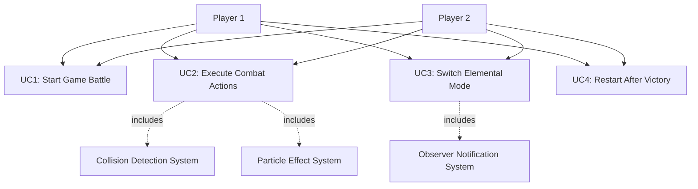
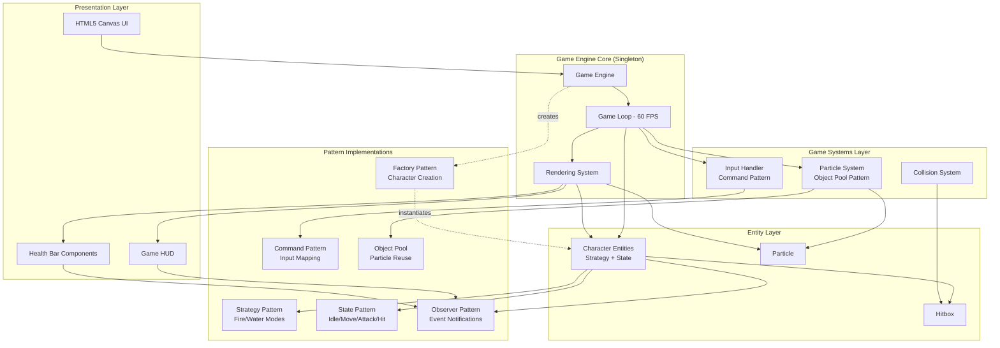
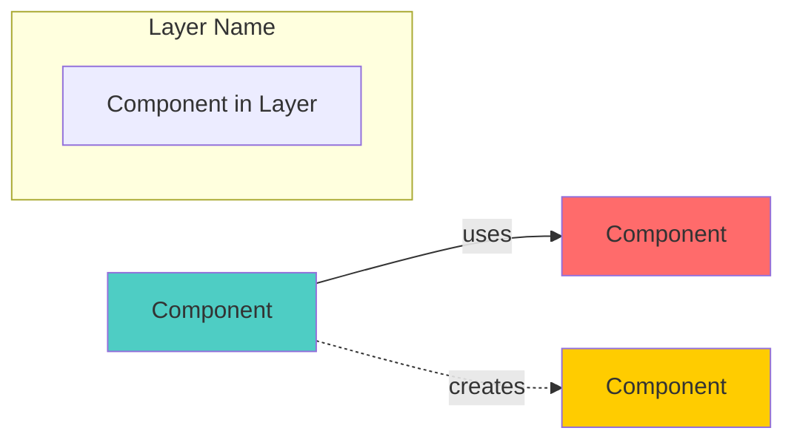

# Software Requirements Document
## Elemental Fighter - A Two-Player Fighting Game

---

## 1. Product Perspective

**Elemental Fighter** is a **standalone web-based two-player fighting game** developed as an educational project to demonstrate object-oriented design patterns in interactive game development. The application runs entirely in the browser using HTML5 Canvas and TypeScript, requiring no server-side components or external dependencies beyond the build toolchain (Vite).

### Context
- **Platform**: Web browser application (desktop/laptop focused)
- **Project Type**: Educational demonstration of design patterns in game development
- **Deployment**: Self-hosted static web application
- **Technology Stack**: TypeScript, HTML5 Canvas, Vite build system

### Key Characteristics
- Local multiplayer game with two players sharing a single keyboard
- Real-time combat mechanics with visual feedback
- Pattern-driven architecture showcasing professional software design practices
- No persistence layer - sessions are ephemeral (battles reset on page refresh)

---

## 2. Product Functions

The system provides the following core functions:

1. **Two-Player Combat System**
   - Simultaneous control of two characters on a shared arena
   - Real-time collision detection and hit registration
   - Health tracking and victory condition detection

2. **Elemental Mode Strategy System**
   - Dynamic switching between Fire Mode (high damage, low defense) and Water Mode (low damage, high defense)
   - Visual differentiation of combat modes
   - Strategic gameplay based on mode selection

3. **Character State Management**
   - Idle, Move, Attack, and Hit states with smooth transitions
   - Physics-based movement with gravity and boundaries
   - Attack cooldowns and hit stun mechanics

4. **Input Handling**
   - Dual keyboard input for two players (WASD/Arrows + action keys)
   - Command pattern for flexible input mapping
   - Prevention of input conflicts between players

5. **Visual Feedback System**
   - Particle effects for attacks (fire/water themed)
   - Health bars with damage animations
   - Mode indicators showing current elemental stance
   - Victory screen overlay

6. **Game Flow Control**
   - Pause/resume functionality
   - Restart mechanism
   - Frame-rate independent game loop

---

## 3. User Characteristics

### Primary Users
**Casual gamers and students** with basic computer literacy who are interested in:
- Local multiplayer party games
- Understanding game development patterns
- Quick, accessible gaming sessions

### User Skill Levels

| User Type | Characteristics | Needs |
|-----------|----------------|--------|
| **Casual Player** | Familiar with basic keyboard controls, no technical knowledge required | Clear visual feedback, intuitive controls, minimal learning curve |
| **CS Student/Developer** | Programming background, interested in design patterns | Well-documented code, clear pattern implementations, extensible architecture |
| **Game Enthusiast** | Experienced with fighting games | Responsive controls, balanced gameplay, strategic depth |

### Accessibility Considerations
- **No color-blindness accommodations** currently (uses red/blue color coding)
- **Two-player local only** (requires physical presence)
- **Keyboard-only input** (no gamepad/touch support)

---

## 4. Constraints

### Platform Constraints
- **Browser Compatibility**: Requires modern browsers supporting ES6+ and HTML5 Canvas (Chrome 90+, Firefox 88+, Edge 90+)
- **Display Requirements**: Minimum 1024×576 pixels viewport
- **Input Device**: Physical keyboard required (mobile/touch not supported)

### Technical Constraints
- **Language**: TypeScript (strict mode enabled)
- **Build System**: Vite (specified in package.json)
- **No Backend**: Pure frontend application, no server communication
- **No Persistence**: Game state is not saved between sessions

### Development Constraints
- **Academic Timeline**: Designed for course project submission
- **Pattern Requirements**: Must demonstrate at least 5 design patterns (Strategy, State, Observer, Command, Factory, Singleton, Object Pool)
- **Code Quality**: Must maintain clean architecture principles

### Performance Constraints
- **Frame Rate**: Target 60 FPS on standard hardware
- **Responsiveness**: Input latency < 16ms
- **Memory**: Efficient particle pooling to prevent memory leaks

---

## 5. System Features (Use Case Based)

### 5.1 Use Case Diagram



---

### 5.2 Use Case 1: Start Game Battle

**Title:** Start Game Battle

**Main Actor:** Player 1 and Player 2

**Goal:** Initialize and begin a fighting game session with two characters ready for combat

**Preconditions:**
- User has opened the application in a web browser
- Browser supports HTML5 Canvas
- Canvas element is successfully rendered
- Both players have access to the keyboard

**Main Flow:**
1. User navigates to the game URL in their browser
2. System loads HTML page and executes main.ts entry point
3. GameEngine singleton is instantiated with canvas reference
4. CharacterFactory creates two Character instances:
   - Player 1 at left starting position (PLAYER1_START)
   - Player 2 at right starting position (PLAYER2_START)
5. Characters are initialized in Fire Mode (default elemental strategy)
6. InputHandler registers keyboard bindings:
   - Player 1: WASD + F (attack) + G (switch mode)
   - Player 2: Arrow keys + K (attack) + L (switch mode)
7. GameHUD subscribes to both characters as Observer
8. CollisionSystem initializes hitbox tracking
9. ParticleSystem creates object pool for visual effects
10. Game loop starts at 60 FPS
11. System renders initial game state with both characters in idle state
12. Control instructions displayed on screen
13. Both players can now input commands

**Postconditions:**
- Both characters are alive with full health (100 HP)
- Characters are in Idle state
- Game is in "Playing" state
- Frame counter begins
- All systems are actively updating

**Alternative Flows:**
- **1a. Canvas not found:**
  - System logs error to console
  - Game does not initialize
  - Error message displayed to user
  
- **1b. Browser compatibility issue:**
  - Canvas rendering fails
  - System attempts fallback context creation
  - If fallback fails, alert user to upgrade browser

---

### 5.3 Use Case 2: Execute Combat Actions

**Title:** Execute Combat Actions

**Main Actor:** Player 1 or Player 2 (initiator of the action)

**Goal:** Perform combat maneuvers including movement, attacking, and dealing/receiving damage

**Preconditions:**
- Game is in "Playing" state
- Character is not defeated (health > 0)
- Character is not in hit stun state (for attack actions)

**Main Flow:**

**Movement Scenario:**
1. Player presses movement key (W/A/S/D or Arrow keys)
2. InputHandler captures keydown event
3. MoveCommand is created and executed
4. Character's inputFlags are updated
5. Current state (Idle/Move) checks for state transition
6. If conditions met, character transitions to MoveState
7. MoveState.update() applies velocity based on input direction
8. Character.update() applies gravity and checks boundaries
9. Character position is updated
10. Renderer draws character at new position

**Attack Scenario:**
1. Player presses attack key (F or K)
2. InputHandler creates AttackCommand
3. AttackCommand.execute() checks if character can attack (cooldown expired, not stunned)
4. Character transitions to AttackState
5. AttackState.enter() creates attack hitbox using current elemental mode
6. Hitbox is positioned based on character facing direction
7. CollisionSystem checks for hitbox intersection with opponent
8. If hit detected:
   - Attacker's elementalMode.attack() calculates damage using Strategy pattern
   - Damage = baseDamage × damageMultiplier (Fire: 1.5x, Water: 0.8x)
   - AttackResult includes damage, knockback, and hit stun
9. Opponent receives damage:
   - Defender's elementalMode.defend() reduces damage using Strategy pattern
   - Final damage = raw damage × (1 - defenseMultiplier) (Fire: 0.9x, Water: 0.5x)
   - Opponent's health is reduced
10. Opponent transitions to HitState
11. ParticleSystem spawns particles at hit location (fire/water themed)
12. GameHUD.HealthBar is notified via Observer pattern
13. Health bar animates damage
14. Attacker's attack cooldown starts
15. Attacker transitions back to Idle after attack duration
16. Defender exits HitState after hit stun duration expires

**Postconditions:**
- Character position is updated (for movement)
- Opponent health is reduced (if attack connected)
- Visual feedback displayed (particles, health bar animation)
- Character states are updated appropriately
- Attack cooldown is active (for attacker)
- Hit stun timer is active (for defender)

**Alternative Flows:**
- **3a. Attack on cooldown:**
  - AttackCommand.execute() exits early
  - No state transition occurs
  - Character remains in current state

- **3b. Attack misses:**
  - Hitbox does not intersect opponent
  - No damage is dealt
  - Attack animation still plays
  - Cooldown still activates

- **3c. Character reaches screen boundary:**
  - Position is clamped to canvas bounds
  - Velocity is zeroed
  - No further movement in that direction

- **3d. Fatal damage dealt:**
  - Opponent's health reaches 0
  - Victory condition is triggered (see Use Case 4)

---

### 5.4 Use Case 3: Switch Elemental Mode

**Title:** Switch Elemental Mode

**Main Actor:** Player 1 or Player 2

**Goal:** Toggle character's elemental mode between Fire and Water, changing combat statistics and visual appearance

**Preconditions:**
- Game is in "Playing" state
- Character is not currently attacking (isAttacking === false)
- Character is not in hit stun (isHitStunned === false)
- Player has not held the switch key (single press detection)

**Main Flow:**
1. Player presses switch mode key (G for Player 1, L for Player 2)
2. InputHandler detects keydown event for switchMode binding
3. InputHandler checks switchModePressed flag to prevent held key repeat
4. SwitchModeCommand is created and executed
5. SwitchModeCommand.execute() calls character.switchElementalMode()
6. Character checks preconditions (not attacking, not stunned)
7. Character toggles elementalMode reference:
   - If currently Fire → switch to WaterModeStrategy
   - If currently Water → switch to FireModeStrategy
8. New mode's properties take effect:
   - **Fire Mode**: damageMultiplier=1.5, defenseMultiplier=0.9, attackSpeed=1.2x, color=#ff4444
   - **Water Mode**: damageMultiplier=0.8, defenseMultiplier=0.5, attackSpeed=0.8x, color=#4488ff
9. Character notifies all Observers (GameHUD) via Observer pattern
10. ModeChangeEvent contains: {playerId, newMode}
11. GameHUD.update() receives event and updates playerModes map
12. GameHUD renders new mode indicator (fire emoji 🔥 or water emoji 💧)
13. Character's visual rendering updates (glow color, primary color)
14. Mode indicator circle appears above character with new color
15. On next attack, new damage/defense multipliers are applied

**Postconditions:**
- Character's elementalMode reference points to new strategy
- Combat statistics are changed according to new mode
- Visual appearance reflects new mode (color, glow)
- GameHUD displays updated mode indicator
- Observers have been notified of the change

**Alternative Flows:**
- **6a. Character is attacking:**
  - switchElementalMode() exits early without changing mode
  - No observer notification
  - Character remains in current mode

- **6b. Character is hit stunned:**
  - switchElementalMode() exits early
  - Character remains in current mode
  - Must wait for hit stun to expire

- **6c. Player holds key down:**
  - InputHandler detects switchModePressed flag is true
  - No command is created
  - Prevents repeated toggling while key is held

**Exception Flows:**
- **No exceptions** - operation is always safe as it only toggles a reference

---

### 5.5 Use Case 4: Restart After Victory

**Title:** Restart After Victory

**Main Actor:** Player 1 or Player 2 (winner can initiate, or either player via 'R' key)

**Goal:** Reset the game state to begin a new round after one player has been defeated

**Preconditions:**
- Game is in "GameOver" state
- One character's health has reached 0
- Victory screen is displayed showing the winner

**Main Flow:**
1. Character's health reaches 0 during combat
2. GameEngine.update() calls checkVictory()
3. checkVictory() determines winner (opponent with health > 0)
4. GameEngine.gameState transitions to "GameOver"
5. GameEngine.showVictory(winnerId) is called
6. Victory screen overlay is rendered with winner announcement
7. Game loop continues but character updates are paused
8. Player presses 'R' key (restart shortcut)
9. Main.ts keydown listener captures 'R' key event
10. engine.restart() is called
11. GameEngine.restart() executes:
    - Resets both characters:
      - health = MAX_HEALTH (100)
      - position = starting positions (PLAYER1_START, PLAYER2_START)
      - velocity = {x: 0, y: 0}
      - State transitions to IdleState
      - Clears all input flags
      - Removes attack hitboxes
      - Resets cooldown timers
    - Clears all active particles from ParticleSystem
    - Resets GameHUD:
      - Health bars reset to full
      - Mode indicators reset to Fire
      - Clears mode switch effects
    - gameState transitions back to "Playing"
    - Victory overlay is cleared
12. Both characters notify Observers of health change (full health)
13. GameHUD.HealthBar animations reset to full bars
14. Game loop resumes normal update cycle
15. Players can immediately begin new round

**Postconditions:**
- Both characters have full health
- Characters are positioned at starting locations
- All states are reset to Idle
- Particle effects are cleared
- Health bars display 100%
- Game is in "Playing" state
- No victory overlay is visible
- Frame counter continues (not reset)

**Alternative Flows:**
- **8a. Player presses 'P' instead of 'R':**
  - Game pauses/unpauses via togglePause()
  - No restart occurs
  - Victory screen remains visible if paused in GameOver state

- **8b. Page is refreshed:**
  - Entire application reinitializes
  - New GameEngine instance is created
  - Same result as restart but with full reinitialization

**Exception Flows:**
- **No exceptions** - restart is always safe and resets to known good state

---

## 6. Non-Functional Requirements

### 6.1 Usability

| Requirement | Description | Metric |
|-------------|-------------|--------|
| **Learning Curve** | New players should understand basic controls within 1 minute | Time to first intentional attack < 60s |
| **Visual Clarity** | Health bars, mode indicators, and attack effects must be immediately recognizable | User testing: 90% can identify mode/health without instruction |
| **Control Responsiveness** | Input commands should feel instantaneous | Input-to-visual-feedback latency < 16ms (1 frame) |
| **Instructions** | On-screen control guide visible at all times | Keyboard shortcuts displayed in HUD |
| **Error Prevention** | No invalid state transitions possible | State machine prevents illegal transitions |

**Key Usability Features:**
- Color-coded players (Player 1: red tones, Player 2: blue tones)
- Emoji indicators for modes (🔥 Fire, 💧 Water)
- Glow effects highlight active characters
- Hit flash provides impact feedback
- Victory screen clearly announces winner

---

### 6.2 Performance

| Requirement | Target | Acceptance Criteria |
|-------------|--------|---------------------|
| **Frame Rate** | 60 FPS | Maintain ≥55 FPS on mid-range hardware (Intel i5, integrated graphics) |
| **Input Latency** | < 16ms | Delta between keypress event and state change < 1 frame |
| **Particle Count** | Efficient at 100+ particles | No FPS drop below 50 with max particle load |
| **Memory Usage** | < 100MB heap | No memory leaks during extended play (30+ minutes) |
| **Load Time** | < 2 seconds | Time from page load to playable game state |
| **Delta Time Handling** | Frame-rate independent | Game behaves identically at 30-120 FPS |

**Performance Optimizations:**
- Object pooling for particles (reuse instead of GC)
- Rectangle intersection checks only for active hitboxes
- Canvas rendering optimizations (save/restore calls minimized)
- Request animation frame for game loop (browser-optimized)

---

### 6.3 Portability

| Platform | Support Level | Notes |
|----------|---------------|-------|
| **Windows** | ✅ Fully Supported | Primary development platform |
| **macOS** | ✅ Fully Supported | Tested on Safari and Chrome |
| **Linux** | ✅ Fully Supported | Tested on Firefox and Chromium |
| **Mobile/Tablet** | ❌ Not Supported | No touch controls, keyboard required |
| **Cloud Gaming** | ⚠️ Untested | May have input latency issues |

**Browser Compatibility:**
- Chrome 90+ ✅
- Firefox 88+ ✅
- Edge 90+ ✅
- Safari 14+ ✅
- Internet Explorer ❌ Not supported

**Build Portability:**
- Development: `npm run dev` (all platforms)
- Production: `npm run build` → static files deployable anywhere
- No OS-specific dependencies

---

### 6.4 Reliability

| Aspect | Requirement | Measure |
|--------|-------------|---------|
| **Crash Resistance** | No crashes during normal gameplay | MTBF (Mean Time Between Failures) > 10 hours |
| **State Consistency** | Game state always valid | No undefined states, all transitions validated |
| **Error Handling** | Graceful degradation on errors | Try-catch in main initialization, console error logging |
| **Recovery** | Restart always works | 'R' key restart succeeds 100% of time from GameOver state |
| **Browser Tab** | Survives tab switching | Game pauses when tab loses focus (via blur event) |
| **Memory Leaks** | No accumulating memory usage | Heap size stable after 1000 particles spawned/destroyed |

**Reliability Features:**
- Singleton pattern ensures single GameEngine instance
- Object pooling prevents runaway object creation
- State pattern prevents invalid state combinations
- Defensive programming: null checks, boundary clamping
- Restart mechanism provides guaranteed recovery path

---

## 7. External Interface Requirements

### 7.1 User Interfaces

#### 7.1.1 Main Game Canvas
- **Dimensions:** 1024×576 pixels (16:9 aspect ratio)
- **Rendering:** HTML5 Canvas 2D context
- **Background:** Gradient from dark purple (#2d1b4e) to dark blue (#1a1a2e)
- **Arena:** Ground line at y=480 with visual decorations

#### 7.1.2 HUD Elements

| Element | Position | Description |
|---------|----------|-------------|
| **Player 1 Health Bar** | Top-left (x:20, y:20) | Red bar, 300px width, shows damage animations |
| **Player 2 Health Bar** | Top-right (x:704, y:20) | Blue bar, 300px width, mirrored from P1 |
| **Player 1 Mode Indicator** | Below health bar (x:30, y:70) | Circle with Fire/Water emoji and color |
| **Player 2 Mode Indicator** | Below health bar (x:944, y:70) | Circle with Fire/Water emoji and color |
| **Center Title** | Top-center (x:512, y:30) | "⚔️ FIGHT ⚔️" |
| **Control Instructions** | Bottom-center (y:561) | Keyboard shortcuts, 11px font |

#### 7.1.3 Victory Screen Overlay
- **Trigger:** When a player's health reaches 0
- **Background:** Semi-transparent black overlay (rgba(0,0,0,0.7))
- **Content:**
  - Large winner announcement text
  - Player color theme
  - Glowing effects matching winner's current mode

#### 7.1.4 Browser Page
- **Title:** "Fighting Game - Strategy Pattern Demo"
- **HTML Structure:**
  - Title header: "⚔️ Elemental Fighter ⚔️"
  - Control info panels (2 boxes showing P1/P2 controls)
  - Canvas container with shadow effects
  - Footer with mode descriptions

---

### 7.2 Software Interfaces

#### 7.2.1 Browser APIs

| API | Purpose | Usage |
|-----|---------|-------|
| **Canvas 2D Context** | Rendering | `canvas.getContext('2d')` for all drawing operations |
| **Window.requestAnimationFrame** | Game loop | Smooth 60 FPS updates synced with display refresh |
| **KeyboardEvent** | Input | `keydown`/`keyup` listeners for player controls |
| **Console API** | Debugging | Logging startup info, errors, warnings |
| **Window Object** | Global state | Exposes gameEngine for dev console debugging |

#### 7.2.2 TypeScript Type System

The application uses TypeScript strict mode with custom type definitions:

**Core Types (src/types/index.ts):**
```typescript
PlayerId: 'Player1' | 'Player2'
ElementalMode: 'Fire' | 'Water'
GameState: 'Menu' | 'Playing' | 'Paused' | 'GameOver'
Vector2: { x: number; y: number }
Rectangle: { x: number; y: number; width: number; height: number }
KeyBindings: { left, right, up, down, attack, switchMode }
AttackResult: { damage, knockback: Vector2, hitStun: number }
HealthChangeEvent: { playerId, currentHealth, maxHealth, damage }
ModeChangeEvent: { playerId, newMode: ElementalMode }
```

#### 7.2.3 Design Pattern Interfaces

| Pattern | Interface | Location |
|---------|-----------|----------|
| **Strategy** | `IElementalMode` | `/src/patterns/strategy/IElementalMode.ts` |
| **State** | `ICharacterState` | `/src/patterns/state/ICharacterState.ts` |
| **Command** | `ICommand` | `/src/patterns/command/Command.ts` |
| **Observer** | `IObserver<T>`, `ISubject<T>` | `/src/patterns/observer/Observer.ts` |
| **Factory** | `CharacterFactory` | `/src/patterns/factory/CharacterFactory.ts` |
| **Object Pool** | `ObjectPool<T>` | `/src/patterns/pool/ObjectPool.ts` |

#### 7.2.4 Build System Interface

**Vite Configuration (vite.config.ts):**
- Development server on port 5173
- Hot Module Replacement (HMR) enabled
- TypeScript compilation integrated
- Asset handling for static files

**Package Scripts:**
```json
"dev": "vite"                    // Start dev server
"build": "tsc && vite build"     // Compile TS + bundle for production
"preview": "vite preview"        // Preview production build
```

#### 7.2.5 Module System

**ES6 Modules** with explicit imports:
- `/src/main.ts` - Entry point
- `/src/core/*` - Core engine systems
- `/src/entities/*` - Game objects (Character, Particle, Hitbox)
- `/src/patterns/*` - Design pattern implementations
- `/src/systems/*` - Game systems (Input, Collision, Particles)
- `/src/ui/*` - UI components (HUD, HealthBar)
- `/src/constants/*` - Configuration constants
- `/src/types/*` - TypeScript type definitions

#### 7.2.6 No External Runtime Dependencies

**Zero Production Dependencies:**
- No game engines (Phaser, PixiJS, etc.)
- No UI frameworks (React, Vue, etc.)
- No utility libraries (Lodash, Three.js, etc.)
- Pure TypeScript + Browser APIs only

**DevDependencies Only:**
- `typescript` ~5.6.2
- `vite` ^6.0.5
- `@types/node` ^22.0.0

---

## 8. Design Software Architecture

### 8.1 High-Level Architecture

**Elemental Fighter** follows a **layered monolithic architecture** with clear separation of concerns organized by design patterns. The architecture is structured as a single-page application with a **pattern-driven game engine core**.



### 8.2 Architectural Layers

#### Layer 1: Presentation Layer
**Responsibility:** User interface and visual rendering

| Component | Technology | Purpose |
|-----------|-----------|---------|
| HTML5 Canvas | Browser API | Rendering surface (1024×576) |
| GameHUD | TypeScript Class | Coordinates UI elements, mode indicators |
| HealthBar | Observer Pattern | Health visualization, damage animations |

**Communication:** Presentation layer subscribes to Entity layer via Observer pattern for reactive UI updates.

---

#### Layer 2: Game Engine Core (Singleton)
**Responsibility:** Central orchestration of all game systems

**GameEngine (Singleton Pattern)**
- **Initialization:** Sets up canvas, creates players via Factory, initializes all systems
- **Game Loop:** `requestAnimationFrame` driven loop with delta time calculation
- **Update Cycle:** Calls update on Input → Characters → Collision → Particles → HUD
- **Render Cycle:** Background → Arena → Characters → Particles → HUD → Debug
- **State Management:** Tracks GameState (Menu/Playing/Paused/GameOver)
- **Victory Detection:** Monitors character health, transitions to GameOver state

**Why Singleton?**
- Guarantees single game instance
- Global access point for systems
- Prevents conflicting game loops
- Ensures consistent canvas reference

---

#### Layer 3: Game Systems Layer
**Responsibility:** Domain-specific subsystems that operate on entities

**InputHandler (Command Pattern)**
- Registers player keyboard bindings
- Translates key events into Command objects (MoveCommand, AttackCommand, SwitchModeCommand)
- Commands mutate character inputFlags
- Prevents input conflicts between players

**CollisionSystem**
- Checks attack hitbox intersections with opponent hurtboxes
- Uses axis-aligned bounding box (AABB) collision detection
- Triggers damage application on hits
- Lightweight rectangle intersection math

**ParticleSystem (Object Pool Pattern)**
- Manages pool of reusable Particle objects
- Spawns fire/water particles on attacks
- Updates particle physics (velocity, lifetime, alpha decay)
- Returns particles to pool when inactive
- Prevents garbage collection overhead

---

#### Layer 4: Entity Layer
**Responsibility:** Core game objects with state and behavior

**Character (Strategy + State + Observer Patterns)**
- **Identity:** `playerId`, `characterType`, `keyBindings`
- **Transform:** `position`, `velocity`, `facingRight`
- **Combat:** `health`, `attackCooldown`, `hitStun`
- **Strategy Pattern:** `elementalMode` (IElementalMode) - Fire/Water combat behavior
- **State Pattern:** `currentState` (ICharacterState) - Idle/Move/Attack/Hit behavior
- **Observer Pattern:** Extends `Subject<HealthChangeEvent | ModeChangeEvent>`
- **Physics:** Gravity application, ground collision, boundary clamping
- **Rendering:** Mode-based coloring, glow effects, attack visuals

**Hitbox**
- Rectangular collision area for attacks
- Tracks owner (`playerId`), damage, position, active state
- Intersection testing with opponent hurtbox

**Particle**
- Visual effect entity (fire sparks, water droplets)
- Physics: velocity, acceleration, lifetime
- Rendering: color, size, alpha blending
- Pooled for performance

---

#### Layer 5: Pattern Implementations
**Responsibility:** Reusable design pattern abstractions

**Strategy Pattern - IElementalMode**
- **Implementations:** `FireModeStrategy`, `WaterModeStrategy`
- **Contract:** `attack()`, `defend()`, `getVisualConfig()`, `getParticleType()`
- **Behavior Variation:**
  - Fire: 1.5× damage, 0.9× defense, fast attacks, red visuals
  - Water: 0.8× damage, 0.5× defense, slow attacks, blue visuals
- **Runtime Switching:** Characters toggle strategies dynamically

**State Pattern - ICharacterState**
- **Implementations:** `IdleState`, `MoveState`, `AttackState`, `HitState`
- **Contract:** `enter()`, `update()`, `exit()`, `canTransition()`
- **State Transitions:**
  - Idle → Move (input detected)
  - Move → Attack (attack key + can attack)
  - Any → Hit (takes damage)
  - Hit → Idle (hit stun expires)
- **Encapsulation:** Each state owns its update logic

**Observer Pattern - Subject/Observer**
- **Subject:** `Character` publishes events
- **Observers:** `HealthBar`, `GameHUD`
- **Event Types:** `HealthChangeEvent`, `ModeChangeEvent`
- **Decoupling:** Entities don't know about UI

**Command Pattern - ICommand**
- **Implementations:** `MoveCommand`, `AttackCommand`, `SwitchModeCommand`
- **Contract:** `execute(character: Character)`
- **Separation:** Input handling decoupled from character logic

**Factory Pattern - CharacterFactory**
- **Purpose:** Centralized character creation
- **Handles:** Initial position calculation, key binding assignment, mode initialization

**Object Pool Pattern - ObjectPool<T\>**
- **Purpose:** Reuse expensive objects (Particles)
- **Operations:** `acquire()`, `release()`, `clear()`
- **Benefit:** Eliminates per-frame allocations

---

### 8.3 How Architecture Facilitates Use Cases

#### Use Case 1: Start Game Battle
**Architecture Support:**
1. **Singleton GameEngine** ensures single game instance initialization
2. **Factory Pattern** creates both characters with correct configuration
3. **Observer Pattern** connects UI to entities during setup
4. **Input Handler** registers keyboard bindings for both players
5. **Object Pool** pre-allocates particle objects for future use

**Flow:** HTML Load → Engine.getInstance() → init() → Factory.createCharacter() → InputHandler.registerPlayer() → Observers attach → start() → Game Loop begins

---

#### Use Case 2: Execute Combat Actions
**Architecture Support:**
1. **Command Pattern** translates keypresses into game actions
2. **State Pattern** manages character behavior transitions (Idle → Attack)
3. **Strategy Pattern** applies mode-specific damage/defense calculations
4. **Collision System** detects hitbox overlaps
5. **Observer Pattern** notifies UI of health changes
6. **Particle System** spawns visual effects via Object Pool

**Flow:** Keypress → InputHandler → Command.execute() → Character.inputFlags → State.canTransition() → AttackState.enter() → Strategy.attack() → Collision detection → Strategy.defend() → HitState → Observer.notify() → HealthBar.update() → ParticleSystem.spawn()

---

#### Use Case 3: Switch Elemental Mode
**Architecture Support:**
1. **Strategy Pattern** allows runtime strategy swapping
2. **Command Pattern** handles switch input as SwitchModeCommand
3. **Observer Pattern** notifies HUD of mode change
4. **State Machine** validates mode switch is allowed (not during attack)

**Flow:** Keypress → SwitchModeCommand → Character.switchElementalMode() → Toggle elementalMode reference → Subject.notify() → HUD.update() → Renderer uses new VisualConfig

---

#### Use Case 4: Restart After Victory
**Architecture Support:**
1. **GameEngine** detects victory condition in update loop
2. **State Management** transitions to GameOver state
3. **Renderer** displays victory overlay based on game state
4. **Restart mechanism** resets all systems and entities
5. **Observer Pattern** notifies UI of health reset

**Flow:** health <= 0 → checkVictory() → gameState = GameOver → showVictory() → 'R' key → restart() → Character.reset() → ParticleSystem.clear() → HUD.reset() → gameState = Playing → Observers notified

---

### 8.4 Architectural Benefits

| Design Goal | Architectural Solution |
|-------------|------------------------|
| **Modularity** | Layered architecture with clear interfaces between layers |
| **Extensibility** | Strategy pattern allows new modes (Ice, Lightning) without changing Character |
| **Testability** | Decoupled systems, dependency injection of observers |
| **Performance** | Object pooling, efficient collision detection, delta-time game loop |
| **Maintainability** | Pattern-based organization, single responsibility classes |
| **Scalability** | Easy to add new states, commands, or particle types |

---

### 8.5 Key Architectural Decisions

1. **Why Layered Architecture?**
   - Clear separation: Presentation → Engine → Systems → Entities → Patterns
   - Enables testing of systems without full game engine
   - Prevents circular dependencies

2. **Why Pattern-Driven Design?**
   - Demonstrates educational goal of pattern usage
   - Provides flexibility for future enhancements
   - Industry-standard practices for game architecture

3. **Why No ECS (Entity-Component-System)?**
   - Fighting game has limited entity types (2 characters + particles)
   - Pattern-based approach is more educational
   - Simpler to understand for CS students

4. **Why Singleton for GameEngine?**
   - Single canvas, single game loop required
   - Prevents accidental multiple instances
   - Global access for debugging

5. **Why Observer for UI?**
   - Decouples entities from UI components
   - Supports reactive UI updates
   - Allows multiple UI subscribers (health bar, damage numbers, etc.)

---

## 9. Architectural Diagram Legend



- **Solid arrows (→):** Direct usage/dependency
- **Dotted arrows (-.->):** Creation/instantiation
- **Subgraphs:** Architectural layers
- **Colors:** Pattern groupings (Strategy, State, Observer, etc.)

---

## 10. Appendix

### 10.1 Design Patterns Summary

| Pattern | Usage | Location | Purpose |
|---------|-------|----------|---------|
| **Singleton** | 1 instance | `GameEngine` | Ensure single game orchestrator |
| **Strategy** | 2 strategies | `FireModeStrategy`, `WaterModeStrategy` | Swap combat behavior at runtime |
| **State** | 4 states | `IdleState`, `MoveState`, `AttackState`, `HitState` | Manage character behavior transitions |
| **Observer** | 2 observers | `HealthBar`, `GameHUD` subscribe to `Character` | Decouple UI from game logic |
| **Command** | 3 commands | `MoveCommand`, `AttackCommand`, `SwitchModeCommand` | Encapsulate input actions |
| **Factory** | 1 factory | `CharacterFactory` | Centralize character creation |
| **Object Pool** | 1 pool | `ParticleSystem` pool for `Particle` | Reuse particles for performance |

### 10.2 File Structure Overview

```
c:/Users/musta/Desktop/Dosyalarım/482/
├── index.html                   # Entry HTML with canvas
├── package.json                 # NPM dependencies
├── tsconfig.json                # TypeScript config
├── vite.config.ts               # Vite build config
└── src/
    ├── main.ts                  # Application entry point
    ├── vite-env.d.ts            # TypeScript environment types
    ├── constants/
    │   └── GameConfig.ts        # Game constants
    ├── core/
    │   └── GameEngine.ts        # Main game loop (Singleton)
    ├── entities/
    │   ├── Character.ts         # Player character (Strategy + State + Observer)
    │   ├── Hitbox.ts            # Collision detection
    │   └── Particle.ts          # Visual effect entity
    ├── patterns/
    │   ├── command/
    │   │   └── Command.ts       # ICommand + implementations
    │   ├── factory/
    │   │   └── CharacterFactory.ts  # Factory Pattern
    │   ├── observer/
    │   │   └── Observer.ts      # Subject/Observer
    │   ├── pool/
    │   │   └── ObjectPool.ts    # Object Pool Pattern
    │   ├── state/
    │   │   ├── ICharacterState.ts
    │   │   ├── IdleState.ts
    │   │   ├── MoveState.ts
    │   │   ├── AttackState.ts
    │   │   └── HitState.ts
    │   └── strategy/
    │       ├── IElementalMode.ts
    │       ├── FireModeStrategy.ts
    │       └── WaterModeStrategy.ts
    ├── systems/
    │   ├── CollisionSystem.ts   # Hitbox detection
    │   ├── InputHandler.ts      # Keyboard → Commands
    │   └── ParticleSystem.ts    # Particle management + Pool
    ├── types/
    │   └── index.ts             # TypeScript type definitions
    └── ui/
        ├── GameHUD.ts           # HUD coordinator (Observer)
        └── HealthBar.ts         # Health bar (Observer)
```

---

## Document Metadata

- **Project Name:** Elemental Fighter
- **Version:** 1.0.0
- **Document Type:** Software Requirements Specification (SRS)
- **Date:** February 11, 2026
- **Course:** Software Engineering (482)
- **Patterns Demonstrated:** 7 (Singleton, Strategy, State, Observer, Command, Factory, Object Pool)

